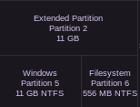
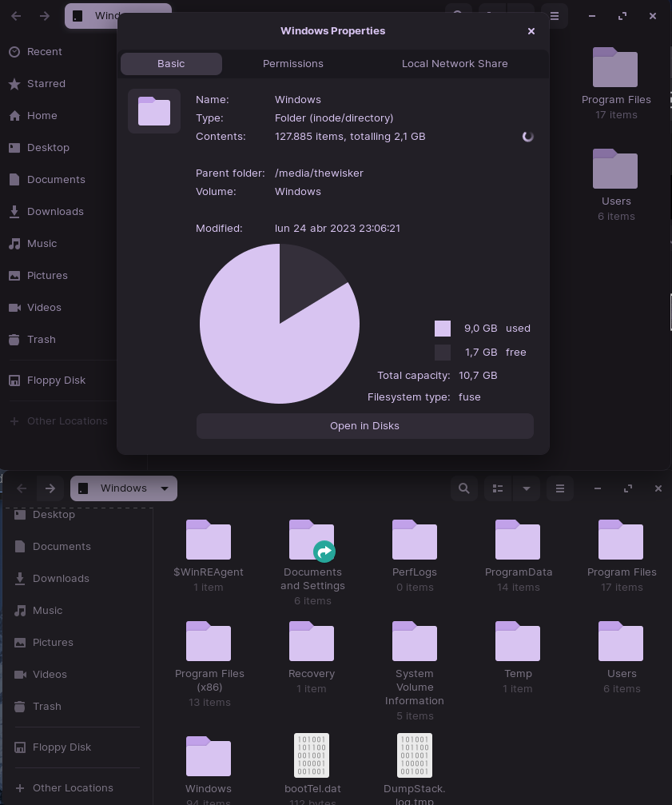

<h1 align="center">WinCompactor</h1>

    

Windows 10 Compacting Script

<h2 align="center">Description</h2>

This is a batch script that reduces Windows 10's size as much as possible!

<h2 align="center">Details</h2>

Keep in mind that this script removes some Windows 10 features you may not want to remove.
The resulting operating system size measured should be around 10GB for Windows 10 Home.
The resulting operating system is intentended to only be capable of running programs.

<h2 align="center">Disclaimer</h2>

WARNING: I do NOT take responsibility for what may happen to your system! Run scripts at your own risk!

<h2 align="center">Screenshots</h2>

<h2 align="center">Usage</h2>

Download this repo and extract the contents. Navigate to the repository root.
Run the main.bat file, input the system drive letter and if it should be defragmented.

<h2 align="center">Author</h2>

    </img>

<h4 align="center">TheWisker</h4>
